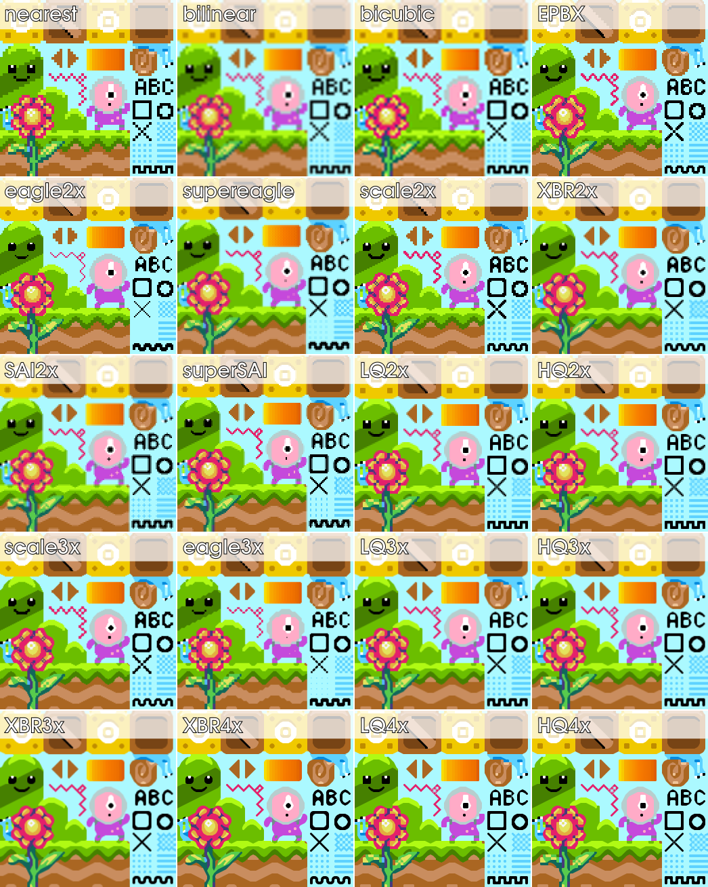

# VNC-Al-e
Dự án triển khai các thuật toán thay đổi kích thước ảnh phổ biến
theo giới thiệu trên [Wiki](https://en.wikipedia.org/wiki/Image_scaling).

# Khung dự án
Sử dụng thư viện [stb](https://github.com/nothings/stb) để dọc ghi ảnh mẫu.

